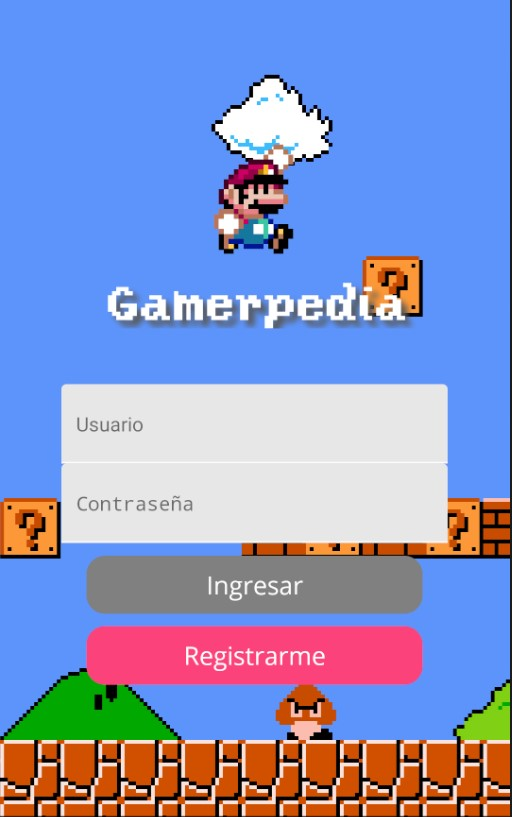

# Gamerpedia App ❤️

## ¿Qué es esto? 👀️

Es una aplicación muy simple donde, usando la API **RAWG** podemos ver detalles sobre los juegos mas recientes del mercado, sus desarrolladores y de algunas plataformas históricas (y mas actuales) de gaming.

## Set up 🚀️

### Antes que nada...

### Ahora si... ¿Cómo comenzamos?

1. Clonar el proyecto
2. Correr un `npm install` para instalar las dependencias correspondientes para ejecutar el proyecto (En la carpeta raíz de este proyecto, donde se encuentra el archivo `package.json`).
3. Si quiero correr el Metro Bundler de manera independiente `react-native start`. El primer bundle puede tardar un poco.
4. Y, si quiero correr este mismo proyecto en un device Android (Virtual o conectado con el debugging habilitado) `react-native run-android`, lo mismo con iOS `react-native run-ios`.

**Y listo! A disfrutar :)**

## Herramientas usadas

* Visual Studio code como IDE principal.
* Postman para probar los servicios.
* Random user Generator como API.
* Git.
* Firebase.
* Typora para la escritura de la documentación.
* React Native con React Native Paper, Navigation y Axios.
* NodeJS y NPM para el manejo de dependencias.
* Android Studio para AVD y el build de Gradle.

